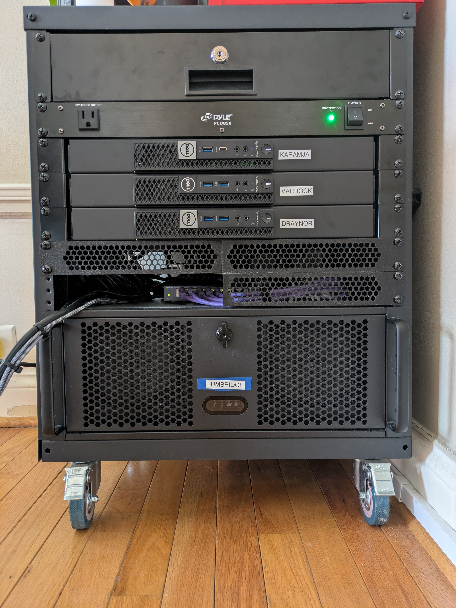

# Homelab 

## Self Hosted Applications

### 🎯 **Momentum**
Helps me keep track of tasks which need to be done every day, and to do them in habit stacks.
- **Tech**: Go, HTMX, CSS
- **Repository**: [mitchfen/momentum](https://github.com/mitchfen/momentum)

###  💪️ **Weight Tracker**
Allows me to track my weight and see a trend line.
- **Tech**: Go, SQLite, HTML, CSS, JS
- **Repository**: [mitchfen/weight-tracker](https://github.com/mitchfen/weight-tracker)

### 💡 **Nanoleaf Controller**
Allow anyone on my home network to control the Nanoleaf light panels without installing a proprietary app on their phone.
- **Tech**: .NET 10, Blazor Server, Nanoleaf OpenAPI
- **Repository**: [mitchfen/nanoleaf-controller](https://github.com/mitchfen/nanoleaf-controller)

### 🔦 **Wiz Controller**
Allow anyone on my home network to control my WiZ lights without installing a proprietary app on their phone.
- **Tech**: .NET 10, Blazor Server
- **Repository**: [mitchfen/wiz-controller](https://github.com/mitchfen/wiz-controller)

### 🏠 **Homer**
Provides a central entry point to all my apps, so people on my home network only have to remember one URL. 
- **Tech**: [Homer](https://github.com/bastienwirtz/homer)

## Hardware

| Name | Form Factor | CPU | C/T | GPU | Memory | OS |
| --- | --- | --- | --- | --- | --- | --- |
| Varrock | Optiplex micro | i3-6100T | 2c/4t | Integrated | 8GB | pfSense |
| Karamja | Optiplex micro | i7-7700T | 4c/8t | Integrated | 16GB | Debian 13 |
| Draynor | Optiplex micro | i5-7600T | 4c/4t | Integrated | 32GB | NixOS |
| Lumbridge | 4U server chassis | Ryzen 5 7600 | 6c/12t | RX 7900 XTX | 32GB | Windows11 |

## Purpose of each machine

- **Karamja** serves as a remote development environment. I keep all my repositories, dependencies, and messy build/dev environment tooling there. This allows me to use my ancient but much beloved Thinkpad as a thin client.
- **Varrock** runs [pfSense](https://www.pfsense.org) and serves as my router/firewall. I added an M.2 to ethernet adapter in addition to the built in ethernet port to serve as the WAN and LAN interfaces.
- **Draynor** runs a single-node kubernetes ([k3s](https://k3s.io/)) cluster that hosts all my applications
- **Lumbridge** was built for gaming but recently I've been using the 24GB of VRAM in the 7900 XTX to try out AI models on my own hardware.

## Networking
- **Reverse Proxy**: [Nginx Proxy Manager (NPM)](https://nginxproxymanager.com) on **Draynor** serves as the entrypoint for all the home services I run on my k3s cluster. I'm leveraging it with Cloudflare and LetsEncrypt to get a valid `*.fenner.nexus` certificate and host my apps without SSL warnings. None of the apps are exposed to the internet, but this setup allows any device on my home network to access `wiz-controller.fenner.nexus` for example, without unsigned certificate warnings in their browser.
- **DNS**: pfSense on **Varrock** runs the recursive Unbound DNS resolver along with [pfBlocker-NG](https://docs.netgate.com/pfsense/en/latest/packages/pfblocker.html). pfBlocker allows me to block ads as well as time wasting sites. pfSense allows me to create custom DNS overrides, which is how I setup independant URLs for each of my apps. 
