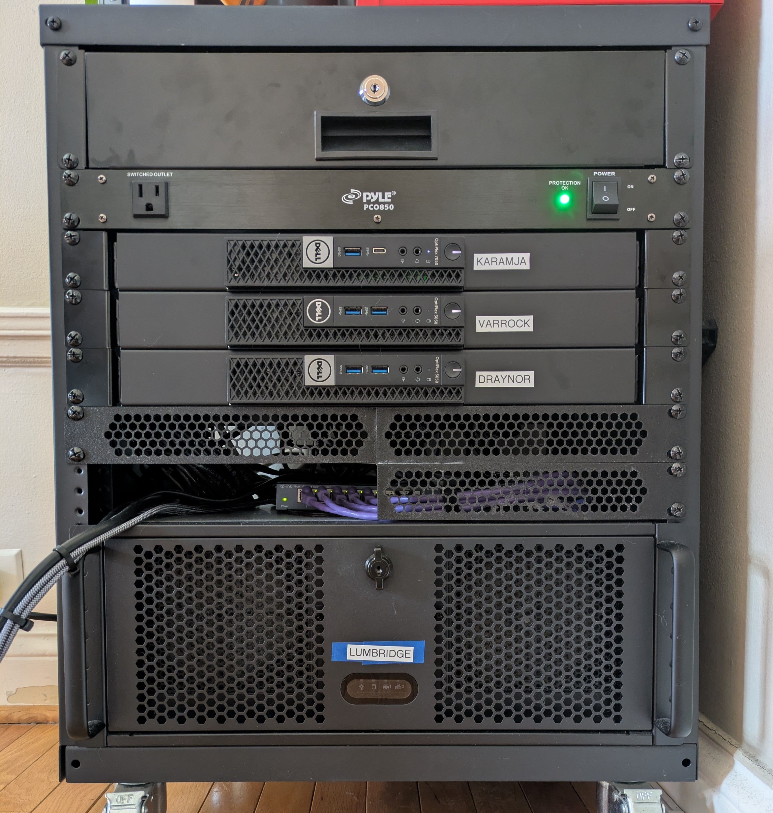
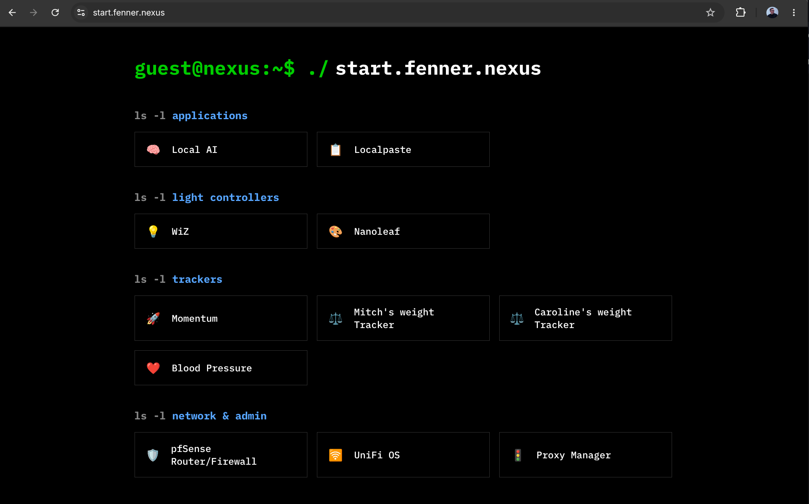
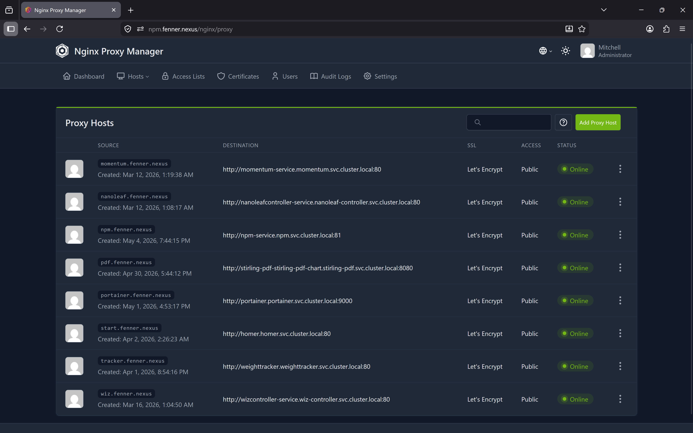

> "Mom, can we have the cloud?"  
> "No. We have the cloud at home."
> 
> The cloud at home:

# Mitch's Homelab 

## Hardware

| Machine | CPU | GPU | CPU release year | C/T |  Memory |Purpose | OS |
| --- | --- | --- | --- | --- | --- | --- | --- |
| Karamja | i7-7700T || 2017 | 4c/8t | 16GB | UnifiOS and SMB Share | Debian 13 |
| Varrock | i3-6100T || 2015 | 2c/4t | 8GB | Router, firewall, adblocking | pfSense |
| Draynor | i5-7600T || 2017 | 4c/4t | 32GB | Kubernetes cluster (k3s) | NixOS |
| Lumbridge | Ryzen 5 7600 | RX 7900 XTX | 2022 | 6c/12t | 32GB | Development, Local AI models | NixOS |

## Networking
- [pfSense](https://www.pfsense.org) handles routing and firewalling.
- All my apps are served on subdomains of `fenner.nexus` a real/public domain, but one with no public DNS records. I use a [Split-horizon DNS](https://en.wikipedia.org/wiki/Split-horizon_DNS) strategy so that my devices resolve those subdomains to the local IP of my cluster.
- [Nginx Proxy Manager](https://github.com/NginxProxyManager/nginx-proxy-manager) acts as the reverse proxy, routing each request to the correct pod via the HTTP `Host` header. It uses the Cloudflare API to obtain a wildcard `*.fenner.nexus` TLS certificate via the [DNS-01 challenge](https://letsencrypt.org/docs/challenge-types/#dns-01-challenge). So every app is served over HTTPS without browser certificate warnings ✨
- [Quad9](https://quad9.net) is my upstream DNS resolver. They block malicious domains at the resolver level.
- The pfSense plugin [pfBlocker-NG](https://docs.netgate.com/pfsense/en/latest/packages/pfblocker.html) provides network-wide IP filtering and DNS blocklisting.
  - **IP filtering:** Blocks traffic to known malicious IP ranges using feeds such as [Spamhaus](https://www.spamhaus.org/blocklists/do-not-route-or-peer/).
  - **Ad blocking:** Blocks ad-serving domains across every device on the network at the DNS level. No adblock browser extension required.
  - **Tracker blocking:** Prevents tracking pixels, analytics scripts, and telemetry endpoints from resolving.
  - **TLD blocking:** Blocks sites that used to suck up all my attention (Instagram, Facebook, Reddit, TikTok) at the DNS level across all devices on the network.
- **No ports are open on my router and no IoT devices are allowed internet access**.

## Local AI

- Recently I've been runnning local AI models using [LM Studio](https://lmstudio.ai) on **Lumbridge**, leveraging my RX 7900 XTX and it's 24 GB of VRAM. 
- I host [Open WebUI](https://github.com/open-webui/open-webui) connected to LM Studio so other users on my home network can talk to my local LLMs. I'm new to local AI learning more about quantization, inference, tuning etc.
- I also connect using GitHub Copilot CLI's BYOM (bring your own model) feature. 
- I'm new to local AI; learning more about quantization, inference, tuning etc.

## Self Hosted Applications

### Custom-Built Apps:
- 💡**Nanoleaf Controller**
  - **Description**: Allow anyone on my home network to control the Nanoleaf light panels without installing an app on their phone.
  - **Tech**: .NET 10, Blazor Server, Nanoleaf OpenAPI, Docker, Kubernetes
  - **Repo**: [mitchfen/nanoleaf-controller](https://github.com/mitchfen/nanoleaf-controller)

- 💡**Wiz Controller**
  - **Description**: Allow anyone on my home network to control my WiZ lights without installing a proprietary app on their phone.
  - **Tech**: Go, HTMX, CSS, Docker, Kubernetes
  - **Repo**: [mitchfen/wiz-controller](https://github.com/mitchfen/wiz-controller)

- 🎯**Momentum**
  - **Description**: Helps me keep track of tasks which need to be done every day, and to do them in habit stacks.
  - **Tech**: Go, HTMX, CSS, Docker, Kubernetes
  - **Repo**: [mitchfen/momentum](https://github.com/mitchfen/momentum)

- 💪**Weight Tracker**
  - **Description**: Allows me to track my weight and see a trend line.
  - **Tech**: Go, SQLite, HTML, CSS, JS, Docker, Kubernetes
  - **Repo**: [mitchfen/weight-tracker](https://github.com/mitchfen/weight-tracker)

- ❤️**Blood Pressure Tracker**
  - **Description**: Allows me to track my blood pressure and visualize trends.
  - **Tech**: Go, HTMX, Tailwind, SQLite, Chart.js, Docker, Kubernetes
  - **Repo**: [mitchfen/blood-pressure-tracker](https://github.com/mitchfen/blood-pressure-tracker)

- 📋**Localpaste**
  - **Description**: Allows me to send text data between devices on my home network with automatic expiration.
  - **Tech**: Go, HTMX, CSS, Docker, Kubernetes
  - **Repo**: [mitchfen/localpaste](https://github.com/mitchfen/localpaste)

- 🚀**Landing Page**
   - **Description**: A simple dashboard that serves as a central entry point to all my apps, so I only have to remember one URL.
   - **Deployment**: The [deploy script](./kubernetes%20manifests/landing-page/deploy.sh) regenerates the manifest and applies `index.html`. No custom container image needed for this one!

### Off-the-Shelf Apps:
- 🤖**Open WebUI**
  - **Description**: Frontend interface for my local LLMs running via LM Studio, allowing anyone on my home network to chat with local AI models.
  - **Repo**: [open-webui/open-webui](https://github.com/open-webui/open-webui)

- 🚦**Nginx Proxy Manager**
  - **Description**: Reverse proxy and entrypoint for all my apps. 
  - **Repo**: [NginxProxyManager/nginx-proxy-manager](https://github.com/NginxProxyManager/nginx-proxy-manager)

- 📡**UniFiOS**
  - **Description**: To manage and control my WiFi access points. This runs on Karamja.

## Landing page
 

## Proxy dashboard

