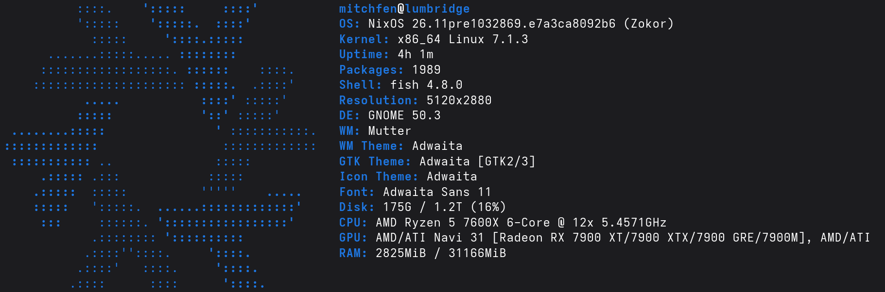
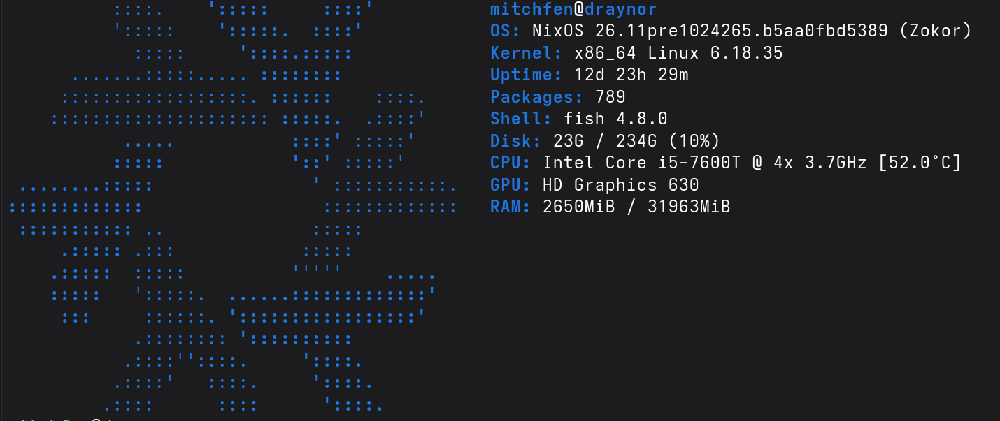
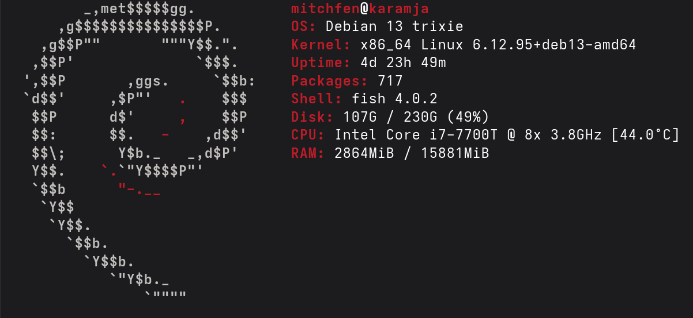

> "Mom, can we have the cloud?"  
> "No. We have the cloud at home."
> 
> The cloud at home:

## Hardware

| Machine | CPU | GPU |  Memory |Purpose | OS |
| --- | --- | --- | --- | --- | --- |
| Karamja | i7-7700T | Integrated | 16GB | UnifiOS (may change back to k3s node)| Debian |
| Varrock | i3-6100T | Integrated | 8GB | Router/firewall, pfblockerNG ad/tracker/IP/TLD blocking | pfSense |
| Draynor | i5-7600T | Integrated | 32GB | Kubernetes cluster (k3s) for most of my apps | NixOS |
| Lumbridge | Ryzen 5 7600X | Radeon RX 7900 XTX  | 32GB | Development, Gaming, Running open source models | NixOS |

<!--
  

  

-->

## NixOS 

2/3 of my Linux hosts run [NixOS](https://nixos.org/). I store their declarative configuration files (`configuration.nix`) in this repo. If a drive fails or a machine dies, I can easily recreate it by installing NixOS, copying over the configuration, and running a command. You might wonder why, then, I run Debian on Karamja. The reason is I want to maintain familiarity with Debian/Ubuntu systems since they're the most common Linux distros.

## Networking and Security

- **No ports are open on my router and no IoT devices are allowed internet access**.
- I use [pfSense](https://www.pfsense.org) for routing and firewalling. It's installed on an OptiPlex micro, and uses the built in NIC for WAN and an RJ45 to M.2 adapter for LAN. The M.2 adapter uses an RTL8125 chipset. Thanks to [Daniel García](https://daniel.es/blog/pfsense-fix-realtek-issues/) for the page detailing how to get realtek drivers installed.
- [Quad9](https://quad9.net) is my upstream DNS resolver. They block malicious domains at the resolver level.
- I use the pfSense plugin [pfBlocker-NG](https://docs.netgate.com/pfsense/en/latest/packages/pfblocker.html) for the following:
  - **IP filtering:** Blocks traffic to known malicious IP ranges using feeds such as [Spamhaus](https://www.spamhaus.org/blocklists/do-not-route-or-peer/).
  - **Ad/Tracker blocking:** Blocks ad and telemetry domains across every device on the network at the DNS level. No adblock browser extension required.
  - **TLD blocking:** Blocks sites that used to suck up all my attention (Instagram, Facebook, Reddit, TikTok) at the DNS level across all devices on the network.

## fenner.nexus

- All my apps are served on subdomains of `fenner.nexus`. That is a public domain, but one with **no public DNS records**. I use a [split horizon DNS](https://en.wikipedia.org/wiki/Split-horizon_DNS) strategy so my devices resolve those subdomains to the local IPs of my devices.
- [Nginx Proxy Manager](https://github.com/NginxProxyManager/nginx-proxy-manager) acts as the reverse proxy, routing each request to the correct pod via the HTTP `Host` header. It uses the Cloudflare API and the [DNS-01 challenge](https://letsencrypt.org/docs/challenge-types/#dns-01-challenge) to obtain a wildcard `*.fenner.nexus` TLS certificate from [Let's Encrypt](https://letsencrypt.org/). So every app is served over HTTPS without browser certificate warnings!
- See my [start page](./landing-page/index.html) (and how it has no certificate warnings 😉). It's stored in a Kubernetes ConfigMap and served by an nginx pod. Terraform manages the ConfigMap, deployment, and service. 

## Terraform

I make changes to my cluster by modifying the code/files in this repo then running `makeItSo.sh` 😎  
This wraps a terraform plan/apply, and brings what used to be managed by bash, kubectl, and helm under one tool-chain. Terraform state is stored in a private Azure Blob Storage container (I know I know, not very "self hosted" of me. But I wanted it off site.)

## Monitoring

I'm not running any critical services on my homelab, but just for learning/educational purposes I'm deploying the [kube-prometheus-stack](https://github.com/prometheus-community/helm-charts/tree/main/charts/kube-prometheus-stack) to my cluster via Terraform. It includes:

- [Prometheus](https://prometheus.io/) to collect and retain Kubernetes and Draynor metrics.
- [Grafana](https://grafana.com/oss/grafana/) to explore metrics and build dashboards.
- [Alertmanager](https://prometheus.io/docs/alerting/latest/alertmanager/) (currently unused)

Grafana and Prometheus use k3s local-path persistent storage, which is covered by the Draynor backup scope. The chart version is pinned in [the monitoring Terraform module](./terraform/modules/monitoring/variables.tf); see [Terraform reminders](./terraform/reminders.md) for deployment, password retrieval, and update instructions.

## Backups

Draynor's stateful data is backed up off-site to Azure Blob Storage. See the [backup plan](./BackupPlan.md).

## Applications I run

### Self Made / Vibe Coded

| App | Description | How | Repository |
| --- | --- | --- | --- |
| Nanoleaf Controller | Allow users on my home network to control my [Nanoleaf light panels](https://nanoleaf.me) without installing the proprietary app on their phone. | Kubernetes| [Link](https://github.com/mitchfen/nanoleaf-controller) |
| Localpaste | Send text data between devices on my home network with automatic expiration. | Kubernetes| [Link](https://github.com/mitchfen/localpaste) |
| Momentum | Keep track of tasks which need to be done every day, and to do them in habit stacks. | Kubernetes | [Link](https://github.com/mitchfen/momentum) |
| Weight Tracker | Track my weight and visualize trends. | Kubernetes | [Link](https://github.com/mitchfen/weight-tracker) |
| Blood Pressure Tracker | Track my blood pressure and visualize trends. | Kubernetes | [Link](https://github.com/mitchfen/blood-pressure-tracker) |
| Wiz Controller | Allow users on my home network to control my [WiZ lights](https://www.wizconnected.com) without installing the proprietary app on their phone. | Kubernetes | [Link](https://github.com/mitchfen/wiz-controller) |
| Landing Page | A simple dashboard that serves as a central entry point to all my apps, so I only have to remember one URL. | Kubernetes | [Link](./landing-page/index.html) |

### Off the Shelf

| App | Description | How | Website |
| --- | --- | --- | --- |
| SearXNG | Privacy respecting internet metasearch engine. | Kubernetes | [Link](https://github.com/searxng/searxng) |
| Open WebUI | Frontend interface for my local LLMs running via LM Studio, allowing anyone on my home network to chat with local AI models. | Kubernetes| [Link](https://github.com/open-webui/open-webui) |
| Nginx Proxy Manager | Reverse proxy and entrypoint for all my apps. | Kubernetes | [Link](https://github.com/NginxProxyManager/nginx-proxy-manager) |
| UniFi OS | Manage and update my Ubiquiti access points. | Debian | [Link](https://help.ui.com/hc/en-us/articles/34210126298775-Self-Hosting-UniFi) |
| pfBlocker-NG | IP filtering, DNS blocklisting, ad/tracker blocking, and TLD blocking. | pfSense Extension | [Link](https://docs.netgate.com/pfsense/en/latest/packages/pfblocker.html) |

## Local AI Models

- Recently I've been runnning local AI models using [LM Studio](https://lmstudio.ai) on **Lumbridge**, leveraging my RX 7900 XTX and it's 24 GB of VRAM. 
- I host [Open WebUI](https://github.com/open-webui/open-webui) connected to LM Studio so other users on my home network can talk to my local LLMs.
- I also connect using GitHub Copilot CLI's BYOM (bring your own model) feature. 