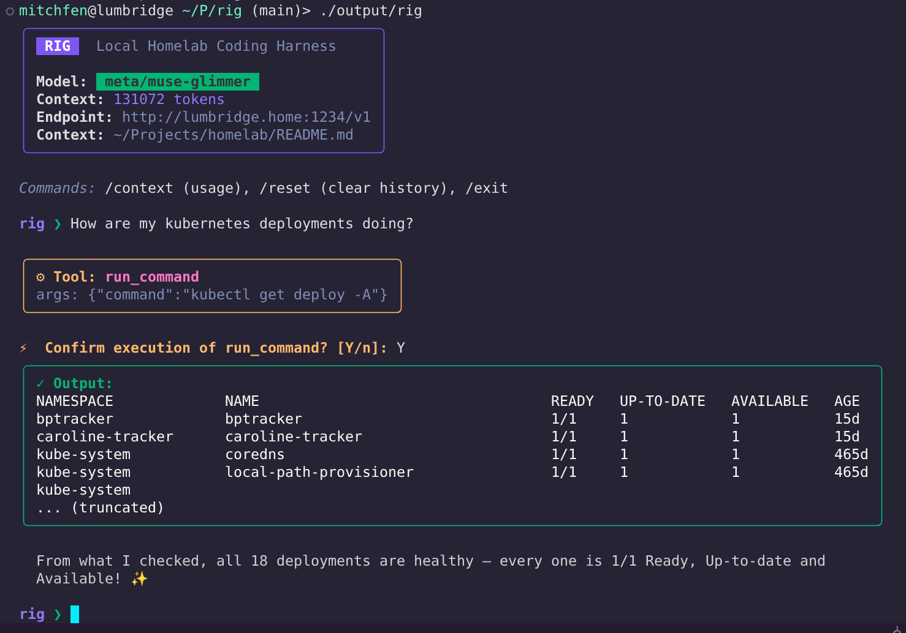

> "Mom, can we have the cloud?"  
> "No. We have the cloud at home."
> 
> The cloud at home:

| Hardware | Description |
|-|-|
|  | **Karamja** Debian box running UniFi OS for my Ubiquiti access points.  **Varrock** My pfSense router, firewall and DNS sinkhole.  **Draynor** NixOs single-node k3s cluster that runs my applications, reverse proxy, and monitoring stack.   **Space for two more OptiPlex Micros** 👀  **Lumbridge** My daily driver, running NixOs. Has a Radeon RX 7900 XTX for running open-source models (and gaming). |

## Networking and Security

- **No ports are open on my router and no IoT devices are allowed internet access**.
- I use [pfSense](https://www.pfsense.org) for routing and firewalling. It's installed on an OptiPlex micro, and uses the built in NIC for WAN and an RJ45 to M.2 adapter for LAN. The M.2 adapter uses an RTL8125 chipset. Thanks to Daniel García's [blog](https://daniel.es/blog/pfsense-fix-realtek-issues/) for the page detailing how to get realtek drivers installed.
- [Quad9](https://quad9.net) is my upstream DNS resolver. They block malicious domains at the resolver level.
- I use the pfSense plugin [pfBlocker-NG](https://docs.netgate.com/pfsense/en/latest/packages/pfblocker.html) for the following:
  - IP filtering: Blocks traffic to known malicious IP ranges using feeds such as [Spamhaus](https://www.spamhaus.org/blocklists/do-not-route-or-peer/).
  - Ad/Tracker blocking: Blocks ad and telemetry domains across every device on the network at the DNS level. No adblock browser extension required.
  - TLD blocking: Blocks sites that used to suck up all my attention (Instagram, Facebook, Reddit, TikTok) at the DNS level across all devices on the network.

## Split Horizon DNS and fenner.nexus

All my apps are served on subdomains of `fenner.nexus`. That is a public domain, but one with **no public DNS records**. I use a [split horizon DNS](https://en.wikipedia.org/wiki/Split-horizon_DNS) strategy so my devices resolve those subdomains to the local IPs of my devices. [Nginx Proxy Manager](https://github.com/NginxProxyManager/nginx-proxy-manager) acts as the reverse proxy, routing each request to the correct pod via the HTTP `Host` header. It uses the Cloudflare API and the [DNS-01 challenge](https://letsencrypt.org/docs/challenge-types/#dns-01-challenge) to obtain a wildcard `*.fenner.nexus` TLS certificate from [Let's Encrypt](https://letsencrypt.org/). So every app is served over HTTPS without browser certificate warnings! See my start page (and how it has no certificate warnings). It's stored in a Kubernetes ConfigMap and served by an nginx pod. Terraform manages the ConfigMap, deployment, and service. 

## Making my Cluster Declarative with Terraform
  

Changes are made to my cluster in two steps:
1. Modify the files as desired
2. Run `makeItSo.sh`  
This wraps a terraform plan/apply, and consolidates what used to be a mishmash of kubectl/bash/helm commands. 

I chose Terraform over GitOps because this is a small, single-node cluster that I update deliberately rather than continuously. Running `makeItSo.sh` gives me one explicit deployment step without maintaining an additional in-cluster controller, although it means the cluster will not automatically reconcile drift or deploy changes when I push to Git.

Terraform state is stored in a private Azure Blob Storage container (I know I know, not very "self hosted" of me. But I wanted it off site.)

## Leveraging Open Source AI Models

I run local AI models using [LM Studio](https://lmstudio.ai) on Lumbridge, leveraging my RX 7900 XTX and its 24 GB of VRAM. I am building [github.com/mitchfen/rig](https://github.com/mitchfen/rig); a CLI harness that helps me leverage my local AI models and learn more about AI tooling.

## Keeping an eye on things

For monitoring I deploy:
- [Prometheus](https://prometheus.io/) to collect and retain Kubernetes and Draynor metrics.
- [Grafana](https://grafana.com/oss/grafana/) to explore metrics and build dashboards.
- [Loki](https://grafana.com/oss/loki/) to aggregate DNSBL logs from pfBlocker-NG.
- [Alertmanager](https://prometheus.io/docs/alerting/latest/alertmanager/) (currently unused).

## Applications I host

### Self Made (Vibe Coded)

| App | Description | How | Repository |
| --- | --- | --- | --- |
| Nanoleaf Controller | Allow users on my home network to control my [Nanoleaf light panels](https://nanoleaf.me) without installing the proprietary app on their phone. | Kubernetes| [Link](https://github.com/mitchfen/nanoleaf-controller) |
| Localpaste | Send text data between devices on my home network with automatic expiration. | Kubernetes| [Link](https://github.com/mitchfen/localpaste) |
| Momentum | Keep track of tasks which need to be done every day, and to do them in habit stacks. | Kubernetes | [Link](https://github.com/mitchfen/momentum) |
| Weight Tracker | Track my weight and visualize trends. | Kubernetes | [Link](https://github.com/mitchfen/weight-tracker) |
| Blood Pressure Tracker | Track my blood pressure and visualize trends. | Kubernetes | [Link](https://github.com/mitchfen/blood-pressure-tracker) |
| Wiz Controller | Allow users on my home network to control my [WiZ lights](https://www.wizconnected.com) without installing the proprietary app on their phone. | Kubernetes | [Link](https://github.com/mitchfen/wiz-controller) |
| Landing Page | A simple dashboard that serves as a central entry point to all my apps, so I only have to remember one URL. | Kubernetes | [Link](./landing-page/index.html) |

### Off the Shelf

| App | Description | How | Website |
| --- | --- | --- | --- |
| SearXNG | Privacy respecting internet metasearch engine. | Kubernetes | [Link](https://github.com/searxng/searxng) |
| Open WebUI | Frontend interface for my local LLMs running via LM Studio, allowing anyone on my home network to chat with local AI models. | Kubernetes| [Link](https://github.com/open-webui/open-webui) |
| Nginx Proxy Manager | Reverse proxy and entrypoint for all my apps. | Kubernetes | [Link](https://github.com/NginxProxyManager/nginx-proxy-manager) |
| UniFi OS | Manage and update my Ubiquiti access points. | Debian | [Link](https://help.ui.com/hc/en-us/articles/34210126298775-Self-Hosting-UniFi) |
| pfBlocker-NG | IP filtering, DNS blocklisting, ad/tracker blocking, and TLD blocking. | pfSense Extension | [Link](https://docs.netgate.com/pfsense/en/latest/packages/pfblocker.html) |
| Grafana | Monitoring and visualizations for my cluster. | Kubernetes | [Link](https://grafana.com) |
| Prometheus | Metrics collection and retention for my cluster. | Kubernetes | [Link](https://prometheus.io) |
| Loki | Currently used just to collect logs from pfBlocker-NG. | Kubernetes | [Link](https://grafana.com/oss/loki/) |

## NixOS (the best distro)

Two of my three Linux hosts run [NixOS](https://nixos.org/). I store their declarative configuration files (`configuration.nix`) here in this repo. If a drive fails or a machine dies, I can easily recreate it by installing NixOS, copying the configuration to `/etc/nixos`, and running `sudo nixos-rebuild switch`. NixOs also works great with AI because the system configuration is clearly readable as text, and in one place.

### Then why Debian on Karamja?
I want to maintain familiarity with Debian/Ubuntu systems since they're the most common Linux systems.

## Backups

Draynor's stateful data is backed up off-site to Azure Blob Storage. See the [backup plan](./BackupPlan.md).
